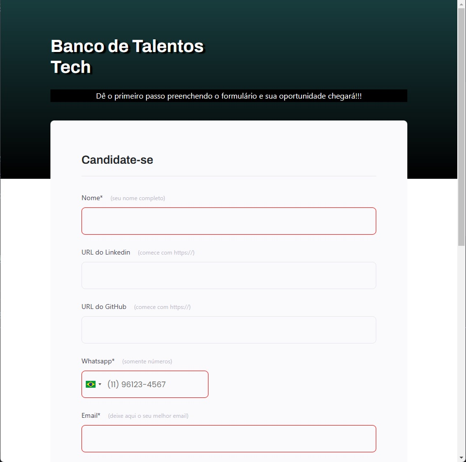
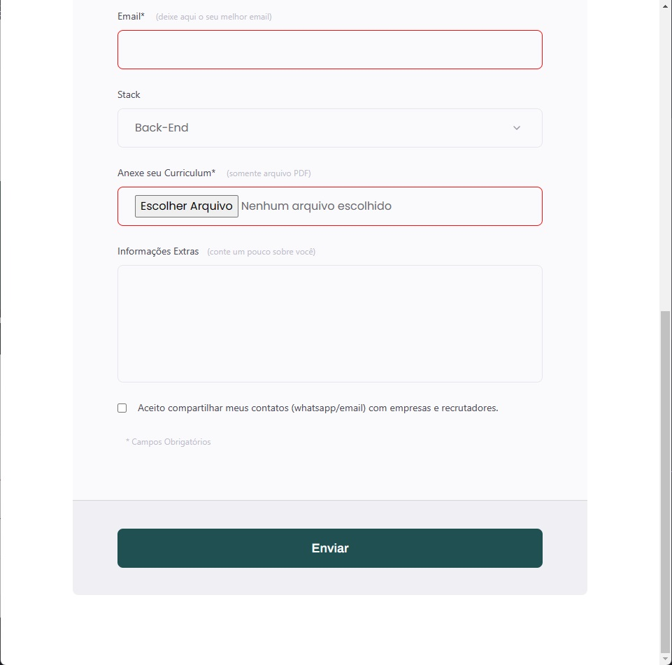

# Formulário HTML e CSS
Formulário desenvolvido em HTML e CSS.
  

## Aprendizados
 Prática com manipulação de tags HTML (input, label, span, fieldset e form), uso do CSS para formatar, estilizar e animar o conteúdo da página.

Foi utilizado o plugin '[int-tel-input](https://github.com/jackocnr/intl-tel-input)' para validar e formatar a entrada de números telefônicos no respectivo campo do formulario.
  

## Funcionalidades
 

- Validação de informações;
- Campos obrigatórios;
- Anexar arquivo PDF;
- Checkbox;
- Opções selecionáveis;
- Animações em CSS (typing e loading spinners ).
  

## Stack utilizada
 

**FRONT-END**  
 

  

## Screenshots

  

## Deploy
 

Visite o deploy do projeto [AQUI](https://vasquesjp.github.io/formularioBTTech/) !!!
  

## 🔗 Links
 

